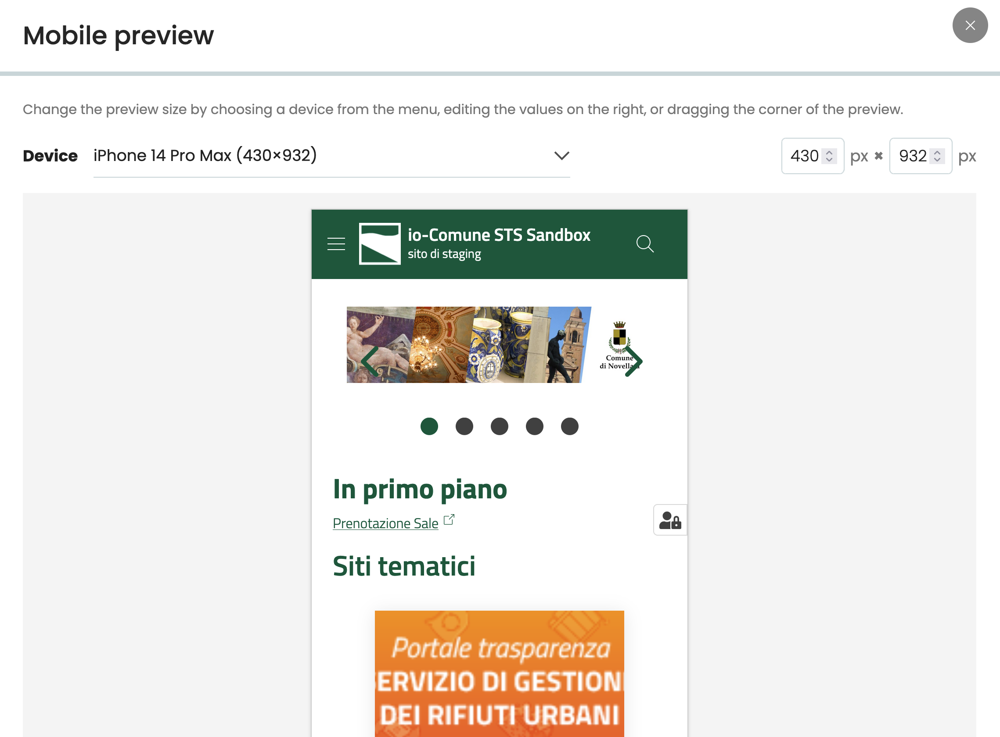

# @plone-collective/volto-mobile-preview

## Introduction

`@plone-collective/volto-mobile-preview` adds a preview button to the Volto toolbar, letting editors preview
how content will look at different screen sizes (mobile, tablet, desktop) without leaving
the backend. Width and height can be set manually or picked from a list of predefined
device sizes.



### Features

- Button in the Volto toolbar, available both in edit and view mode
- Only visible to users with the `Editor` role (configurable, see below)
- Preview reflects the saved/published content, not unsaved draft changes
- Device-size presets (iPhone, iPad, Galaxy, Desktop, ...) or manual width/height in pixels
- Manual resize by dragging the corner of the preview frame
- The previewed page loads without the editing toolbar: on Chrome/Edge it loads with
  `credentialless`, i.e. without forwarding cookies/session, so it renders exactly as an
  anonymous visitor would see it; on browsers without `credentialless` support the toolbar
  is hidden instead

### Configuration

By default, only users with the `Editor` role can see the preview button. Override the list
of allowed roles from your project's own `config.js` (applied after addons):

```js
config.settings.mobilePreviewRoles = ['Editor', 'Contributor'];
```

## Development

You can develop an add-on in isolation using the boilerplate already provided by the add-on generator.
The project is configured to have the current add-on installed and ready to work with.
This is useful to bootstrap an isolated environment that can be used to quickly develop the add-on or for demo purposes.
It's also useful when testing an add-on in a CI environment.

```{note}
It's quite similar when you develop a Plone backend add-on in the Python side, and embed a ready to use Plone build (using buildout or pip) in order to develop and test the package.
```

The dockerized approach performs all these actions in a custom built docker environment:

1. Generates a vanilla project using the official Volto Yo Generator (@plone/generator-volto)
2. Configures it to use the add-on with the name stated in the `package.json`
3. Links the root of the add-on inside the created project

After that you can use the inner dockerized project, and run any standard Volto command for linting, acceptance test or unit tests using Makefile commands provided for your convenience.

### Setup the environment

Run once

```shell
make dev
```

which will build and launch the backend and frontend containers.
There's no need to build them again after doing it the first time unless something has changed from the container setup.

In order to make the local IDE play well with this setup, is it required to run once `yarn` to install locally the required packages (ESlint, Prettier, Stylelint).

Run

```shell
yarn
```

### Build the containers manually

Run

```shell
make build-backend
make build-addon
```

### Run the containers

Run

```shell
make start-dev
```

This will start both the frontend and backend containers.

### Stop Backend (Docker)

After developing, in order to stop the running backend, don't forget to run:

Run

```shell
make stop-backend
```

### Linting

Run

```shell
make lint
```

### Formatting

Run

```shell
make format
```

### i18n

Run

```shell
make i18n
```

### Unit tests

Run

```shell
make test
```

### Acceptance tests

Run once

```shell
make install-acceptance
```

For starting the servers

Run

```shell
make start-test-acceptance-server
```

The frontend is run in dev mode, so development while writing tests is possible.

Run

```shell
make test-acceptance
```

To run Cypress tests afterwards.

When finished, don't forget to shutdown the backend server.

```shell
make stop-test-acceptance-server
```

### Release

Run

```shell
make release
```

For releasing a RC version

Run

```shell
make release-rc
```
